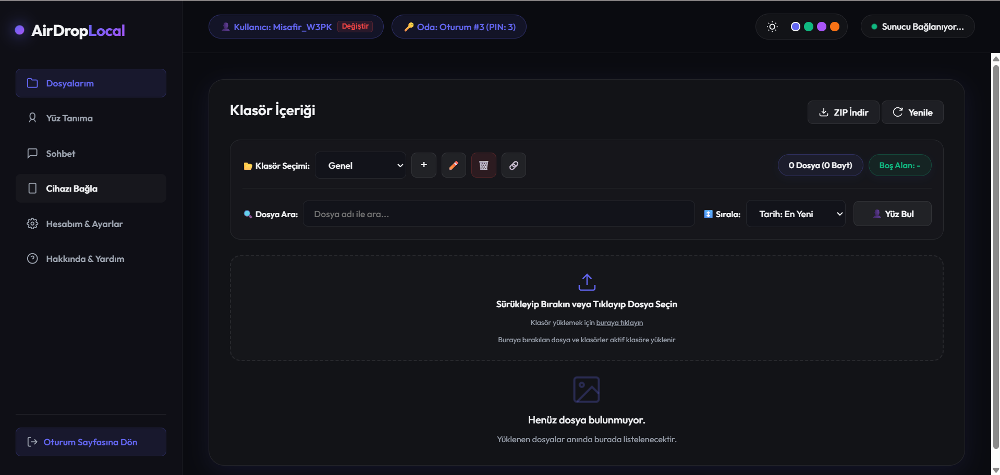
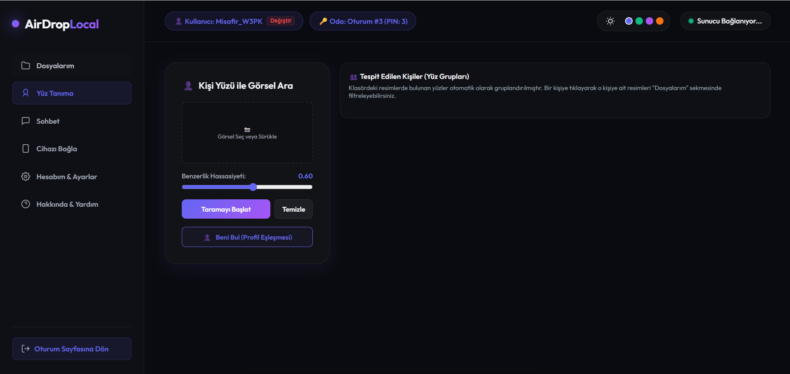
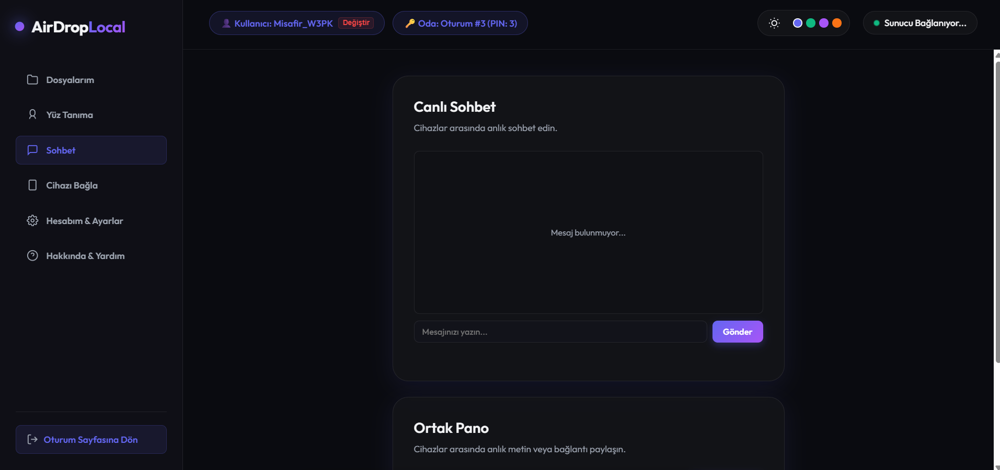
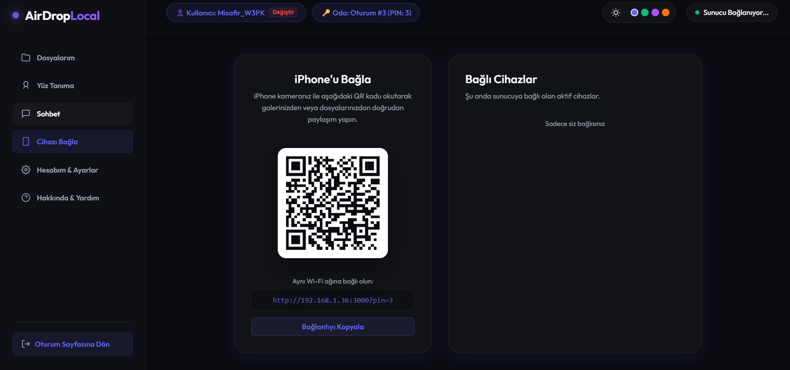
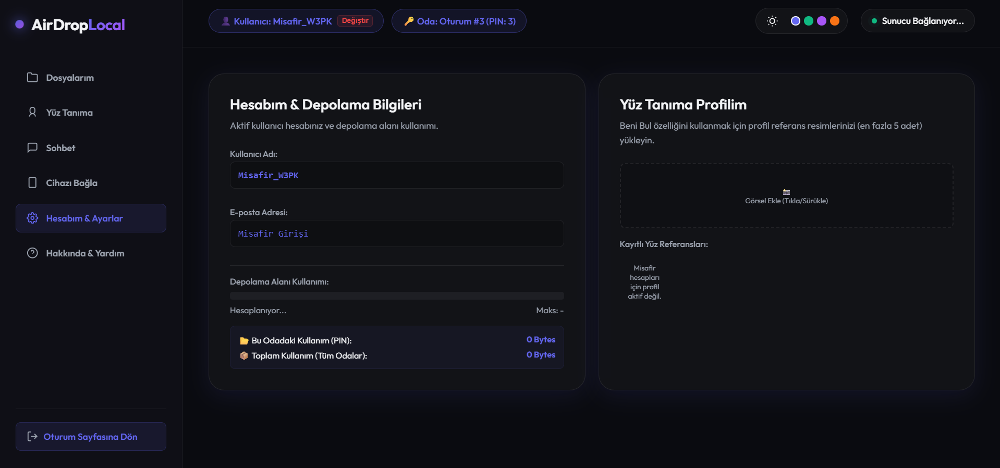
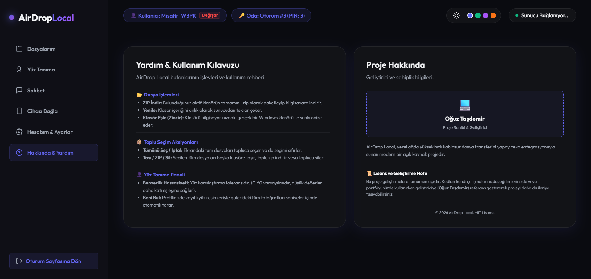

# AirDrop Local - Kablosuz Dosya Paylaşım & İletişim Merkezi 🚀

[](https://nodejs.org/)
[](https://www.python.org/)
[](LICENSE)
[](#)

## 📸 Ekran Görüntüleri ve Arayüz Tanıtımı

Projenin öne çıkan ekranları ve kullanıcı arayüzü aşağıda detaylı açıklamalarıyla listelenmiştir:

| Ekran | Açıklama |
|---|---|
|  | **1. Dosya Yönetimi Paneli (Dosyalarım):** Sürükle-bırak dosya yükleme, klasör yönetimi, Windows yerel dizin eşleme ve toplu işlem (Batch Actions) butonlarının bulunduğu ana ekran. |
|  | **2. Yapay Zeka Destekli Yüz Tanıma:** Fotoğraflardaki yüzleri otomatik tespit edip gruplayan ve tıklama ile ilgili kişiye ait resimleri anında listeleyen Face-API.js paneli. |
|  | **3. Canlı Sohbet & Ortak Pano:** Bağlı tüm cihazlar arasında anlık kopyalanan metinleri senkronize eden ortak pano ve gerçek zamanlı mesajlaşma ekranı. |
|  | **4. Cihaz Bağlantı Ekranı:** Mobil cihazların şifre veya oturum açma zahmetine girmeden QR kod ile saniyeler içinde odaya bağlanmasını sağlayan entegrasyon paneli. |
|  | **5. Hesabım & Depolama Bilgileri:** Toplam disk alanı kotasını, oda bazlı doluluk oranlarını gösteren depolama grafiği ve şifre güncelleme formu. |
|  | **6. Hakkında & Yardım Ekranı:** Uygulama içerisindeki butonların işlevleri, kullanım ipuçları, yüz tanıma hassasiyeti ayarları ve geliştirici/lisans bilgilerinin yer aldığı yardım paneli. |


AirDrop Local, yerel ağınızda (Wi-Fi) bilgisayarınız ve mobil cihazlarınız (iPhone/Android) arasında kablosuz olarak dosya, medya ve veri transferi yapabilmenizi sağlayan **Hesap Yönetimi (User Profiles)** ve **Çoklu Oturum (Multi-Session)** destekli, ultra-premium tasarımlı yerel bir bulut paylaşım merkezidir.

Gelecekte harici bir web sunucusuna (domain) taşınmaya tamamen uygun şekilde tasarlanan modüler mimarisi sayesinde, her kullanıcı kendi profilini seçip o profile ait bağımsız oturumlar oluşturabilir.

---

## 🌟 Öne Çıkan Özellikler

### 1. Kullanıcı Giriş Sistemi, Misafir Modu ve Oturum Yönetimi 👤🔑
* **Kullanıcı Kayıt & Giriş:** Kullanıcı adı/e-posta ve şifre ile güvenli üyelik ve giriş sistemi. Şifreler arka planda `bcryptjs` kullanılarak güvenli şekilde hash'lenir.
* **Hesabım & Ayarlar:** Şifre güncelleme (eski şifre doğrulamalı) ve anlık disk depolama limiti/kullanım istatistiklerinin gösterimi.
* **Misafir Girişi (Guest Mode):** Hesap oluşturmak istemeyen kullanıcılar için tek tıkla otomatik oluşturulan geçici misafir hesabı (örn. `Misafir_A4B8`).
* **Şifre Sıfırlama (Forgot Password):** E-posta doğrulamalı, 6 haneli geçici kod ile şifre sıfırlama sistemi.
* **SMTP & Test Modu:** Şifre sıfırlama kodları kurulan bir SMTP sunucusu aracılığıyla e-posta olarak gönderilir; SMTP sunucusu ayarlanmadığında ise kodlar otomatik olarak sunucu terminal konsoluna yazdırılır (Test Modu).
* **Sıralı Oturum Numaralandırması:** Her kullanıcının kendi profilinde bağımsız oturumlar açabilmesi için sıralı PIN numaraları kullanılır (örn: Oturum #1, Oturum #2).

### 2. Çift Katmanlı Sandbox İzolasyonu 🔒
* **Gelişmiş Depolama Mimarisi:** Yüklenen tüm dosyalar `downloads/account_[username]/session_[pin]/` dizin yapısı altında tamamen yalıtılmış olarak saklanır.
* **SSE (Server-Sent Events) Güvenliği:** Bildirimler, canlı sohbet mesajları ve bağlı cihaz listeleri sadece aynı hesaba ve oturuma bağlı cihazlar arasında senkronize edilir.

### 3. PC Arayüzü: Sidebar & Workspace Sekmeleri 📁💬
* **Kullanıcı Dostu Panel:** PC görünümündeki görsel kalabalık kaldırılmış, sol tarafa modern bir yan menü (Sidebar) eklenmiştir.
* Sekmeli yapısı sayesinde kullanıcılar:
  * **Dosyalarım** sekmesinden klasör yönetimi, arama, sıralama ve sürükle-bırak yükleme yapabilir.
  * **Yüz Tanıma** sekmesinden gelişmiş yapay zeka tabanlı yüz arama ve gruplama yapabilir.
  * **Sohbet & Pano** sekmesinden anlık mesajlaşabilir ve kopyalanan metinleri/linkleri paylaşabilir.
  * **Cihazı Bağla** sekmesinden QR kodunu ve bağlı cihaz listesini kontrol edebilir.

### 4. Akıllı Yüz Tanıma & Kişi Gruplama 🧬👁️
* **Face-API.js Entegrasyonu:** Sunucu üzerindeki görseller taranarak tespit edilen benzersiz yüzler çıkarılır ve gruplandırılır.
* **Eşleşme Hassasiyeti Kontrolü:** Benzerlik toleransı (Treshold) dinamik olarak ayarlanabilir.
* **Hızlı Profil Referansı:** Kullanıcı kendi profil resmiyle eşleşen fotoğrafları anında filtreleyebilir.
* **Tıklama ile Filtreleme:** Keşfedilen yüzlerden birine tıklandığında otomatik olarak Dosyalarım sekmesine geçiş yapılarak ilgili kişinin bulunduğu tüm fotoğraflar anında süzülür.
* **Önbellek Desteği:** Klasöre özel `.face_cache.json` dosyası sayesinde taranmış yüzler önbelleğe alınır, her seferinde tekrar tarama yapılması önlenir.

### 5. Gelişmiş Batch Dosya İşlemleri 📦
* **Toplu Seçim & Yönetim:** Dosyalar tek tek veya "Tümünü Seç" tuşu ile toplu olarak seçilebilir.
* **Toplu İşlemler:** Seçilen tüm dosyalar toplu olarak silinebilir, tek bir ZIP dosyası halinde indirilebilir veya sistemdeki başka bir klasöre/hızlı yola taşınabilir.
* **Fiziksel Dizin Eşleme (Folder Mapping):** Klasörleri yerel bilgisayardaki gerçek Windows dizinlerine (Desktop, Documents, Downloads vb.) eşleyerek doğrudan yerel diskle senkronize çalışma imkanı.

### 6. Mobil Arayüzü: Alt Navigasyon Barı & Cihaz Kimliği 📱
* **Bottom Navigation:** Mobil cihazlarda tek elle kullanımı kolaylaştırmak için sayfanın altına iOS/Android standartlarında ikonlu alt navigasyon barı yerleştirilmiştir.
* **Cihaz Kimliği Giriş Ekranı:** Telefondan ilk kez bağlanıldığında kullanıcıya cihaz adını (örn. `Oğuz iPhone`) soran modern bir modal açılır. Bu isim sistemde kalıcı olarak saklanır ve paylaşımlarda görünür.
* **Ses Kaydedici Widget'ı:** Mobil mikrofondan ses kaydı alıp anında sunucuya yükleme imkanı.

### 7. Tarayıcı İçi Gelişmiş Medya Oynatıcı & Fotoğraf Lightbox 🎵🎥🖼️
* Ses (`.mp3`, `.wav`, `.m4a`) veya video (`.mp4`, `.mov`) dosyalarını indirmeden doğrudan tarayıcı içindeki özel oynatıcı üzerinden oynatabilme.
* Fotoğrafları tam ekran (Lightbox) açarak klavye okları veya ekran butonlarıyla görseller arasında geçiş yapabilme.

---

## 📂 Klasör Yapısı

Projemiz, modüler ve sürdürülebilir bir yazılım mimarisi hiyerarşisine sahiptir:

```text
Airdrop/
├── main.py            # Uygulamayı başlatan ana Python betiği (Node.js & Ağ denetimleri)
├── package.json       # Node.js bağımlılık tanımları
├── package-lock.json  # Node.js bağımlılık kilitleme dosyası
├── README.md          # GitHub / Proje ana açıklama kılavuzu
├── Dockerfile         # Docker imaj oluşturma yapılandırması
├── docker-compose.yml # Docker Compose çoklu konteyner orkestrasyonu
├── .env.example       # Ortam değişkenleri şablon dosyası
├── data/              # JSON veritabanları dizini
│   ├── users.json     # Kullanıcı hesap verileri ve şifre hash'leri
│   └── sessions.json  # Aktif oturum ve oda verileri
├── docs/              # Proje ek dokümantasyonları
│   ├── klasor.md      # Ayrıntılı klasör ve dosya yapısı kılavuzu
│   ├── api.md         # Detaylı HTTP REST ve SSE API dokümantasyonu
│   └── yardim.md      # Uygulama içi butonlar ve kullanım kılavuzu
├── src/               # Arka Uç (Backend) kaynak dosyaları
│   ├── server.js      # Express.js ana sunucu giriş noktası ve SSE yönetimi
│   ├── config.js      # Sunucu ayarları, SMTP ve veritabanı/fiziksel disk yardımcıları
│   ├── authRoutes.js  # Giriş, kayıt, şifre değiştirme/sıfırlama ve profil görseli API'leri
│   ├── sessionRoutes.js # Canlı oda/oturum SSE akışı ve yönetim API'leri
│   ├── folderRoutes.js  # Klasör oluşturma, silme, adlandırma ve dizin eşleme API'leri
│   ├── fileRoutes.js  # Tekli/Toplu yükleme, silme, taşıma, ZIP indirme ve yüz önbelleği API'leri
│   └── chatRoutes.js  # Sohbet geçmişi ve ortak pano API'leri
├── public/            # Ön Uç (Frontend) dosyaları
│   ├── index.html     # SPA ana arayüz tasarımı (Glassmorphism & Modaller)
│   ├── style.css      # Premium görsel tasarım, koyu/açık tema ve animasyon stilleri
│   ├── app.js         # Ön yüz ana koordinatörü ve SSE dinleyicileri
│   └── js/            # Ön yüz modüler JS dosyaları
│       ├── state.js   # Global State yönetimi, toast uyarıları ve secureFetch
│       ├── auth.js    # Oturum açma, şifre güncellemeleri ve kota bilgileri
│       ├── clipboard.js # Sohbet ve ortak pano kopyalama aksiyonları
│       ├── media.js   # Lightbox galerisi, medya oynatıcı ve ses kaydedici
│       ├── faces.js   # Face-API yüz tarama, gruplama ve filtreleme
│       └── files.js   # Dosya listeleme, toplu seçim, taşıma ve dizin eşleme modalı
└── downloads/         # Yüklenen dosyaların yalıtılmış şekilde depolandığı dizin

```

---

## 🛠️ Gereksinimler

* Bilgisayarınızda **Node.js** (Sürüm 16.x veya üzeri) yüklü olmalıdır. ([nodejs.org](https://nodejs.org/) üzerinden ücretsiz indirebilirsiniz.)
* Python 3.x sürümü.

---

## 🚀 Kurulum ve Çalıştırma

1. Proje ana klasöründe bir terminal veya komut satırı açın.
2. Uygulamayı ve otomatik bağımlılık kontrollerini başlatmak için aşağıdaki komutu çalıştırın:
   ```bash
   python main.py
   ```
3. `main.py` otomatik olarak gerekli Node.js paketlerini (`express`, `multer`, `archiver`, `adm-zip`, `bcryptjs`) tespit eder, eksik olanları arka planda kurar ve sunucuyu ayağa kaldırır.
4. Sunucu hazır olduğunda tarayıcınızda otomatik olarak bilgisayar arayüzü açılacaktır.
5. Telefonunuzla veya başka bir cihazla bağlanmak için ekrandaki QR kodu taratmanız yeterlidir. QR kod okutulduğunda mobil cihaz şifre girmeden otomatik olarak ilgili hesaba ve oturum sandboksuna bağlanacaktır.

### 🐳 Docker ile Çalıştırma (Alternatif)

Eğer sisteminizde Node.js veya Python yüklü değilse, projeyi Docker ve Docker Compose kullanarak izole bir şekilde ayağa kaldırabilirsiniz:

1. Gerekli SMTP ve Port ayarları için `.env.example` dosyasını `.env` olarak kopyalayın.
2. Aşağıdaki komutu çalıştırarak konteyneri başlatın:
   ```bash
   docker-compose up -d --build
   ```
3. Uygulamaya tarayıcınızdan `http://localhost:3000` adresinden erişebilirsiniz.

---


## 🔒 Lisans

Bu proje **MIT Lisansı** ile lisanslanmıştır. Detaylar için lisans dosyalarını inceleyebilirsiniz.
